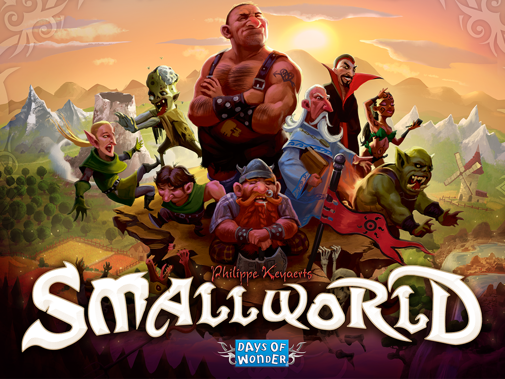

# Small World — Unofficial Simplified Chinese Language Pack



Fan / learning project. **Not affiliated with Days of Wonder, Asmodee, or Valve.**

## For players — one EXE

Distribute a single file:

```text
dist/SmallWorld-cn.exe
```

It **embeds** the Chinese resources. Double-click it to:

| Button | Action |
|--------|--------|
| **启动游戏** | Launch via Steam only — does **not** turn Chinese on/off |
| **启用中文 / 关闭中文** | Toggle: install+enable, or restore the original language pack |

You do **not** need to change Steam to Dutch. The tool hooks whatever language Steam is currently using (Japanese, English, …).

**v2.1.0+** also installs thicker Simplified Chinese UI fonts (Noto Sans SC) and bumps rulebook CSS so high-resolution displays stay readable.

No Python and no separate installer are required on the player’s PC.

### CLI (optional)

```bat
SmallWorld-cn.exe --enable
SmallWorld-cn.exe --disable
SmallWorld-cn.exe --launch
SmallWorld-cn.exe --uninstall
```

## For developers

```bat
git clone https://github.com/kyle-ip/small-world-zh-cn.git
cd small-world-zh-cn
python -m pip install -r requirements.txt
powershell -ExecutionPolicy Bypass -File tools\build_allinone.ps1
```

Requires Python 3.11+, packages in `requirements.txt`. Icon is taken from a local `SmallWorld.exe` when present.

The clone includes the full `payload/` (Chinese strings, baked images, compendium, OFL fonts). That is enough to run or rebuild the player EXE. Regenerating artwork from English/Japanese sources additionally needs a Small World 2 install.

Repo layout:

```text
payload/     Chinese assets embedded into the EXE at build time
launcher/    GUI / Steam hook / payload install source
tools/       build scripts
docs/        notes
```

The older Inno Setup flow under `installer/` is optional legacy; the supported player deliverable is **`SmallWorld-cn.exe`**.

## Disclaimer

Unofficial, for learning only. Do not sell this patch or redistribute the game.
